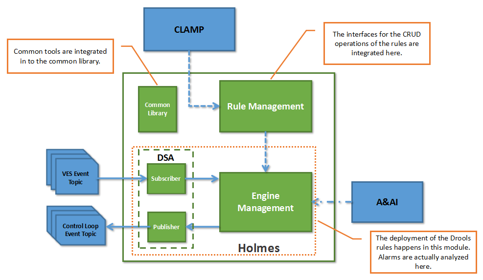

.. This work is licensed under a Creative Commons Attribution 4.0 International License.

Delivery
--------

Describe how functions are packaged into run-time components. For some components a block diagram may be useful.
As mentioned in the architecture chapter, Holmes mainly comprises two modules: a rule management module and an engine management module.

* Rule Management Docker: The main operations on the rules are performed in this module. The module provides CRUD operation interfaces and is reponsible of the persistence of the rules as well.

* Engine Management Docker: The Drools rules are actually deployed into the Drools engine which is embedded within the engine management module. The analysis tasks are excuted in this module as well. Alarm messages are converted to Holmes-compatible format and put into the Drools engine for analysis.

* Common Library: The library hosts some supportive tools for both the rule management module and the engine management module. It is not run separately. Instead, it is introduced into the main modules of Holmes during the compile and package phase.

